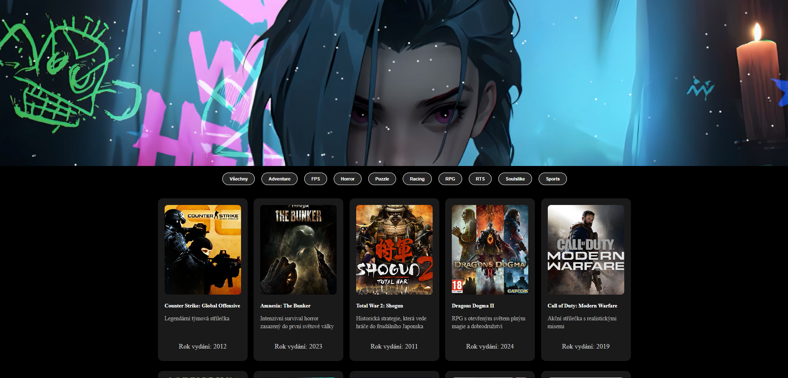
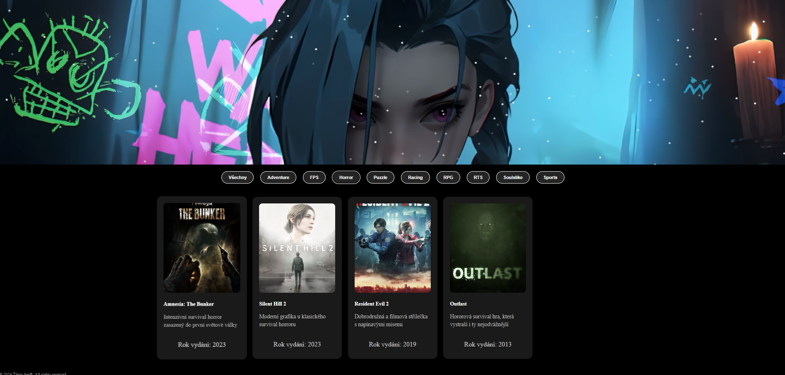
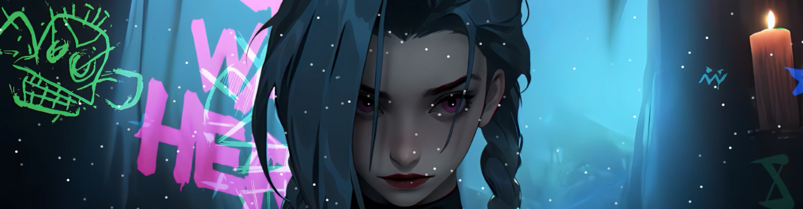

# Projekt: Herní stránka

## Popis projektu
Tento projekt je jednoduchá webová aplikace umožňující zobrazení a filtrování her podle žánru. Stránka obsahuje interaktivní prvky, jako je filtrování her a efekt padajících sněhových vloček.

## Použité technologie
- **HTML**: Struktura webové aplikace.
- **CSS**: Styling stránky.
- **JavaScript**: Interaktivní prvky (filtrování, sněhový efekt).
- **PHP**: Propojení s databází a generování obsahu stránky.
- **MySQL**: Databáze pro ukládání informací o hrách.

## Funkce aplikace
1. Filtrování her podle žánrů. 
2. Zobrazení detailů o hrách (název, žánr, popis, datum vydání).
3. Efekt padajících sněhových vloček na pozadí.

## Struktura projektu
- `get_games.php`: Hlavní stránka načítající data z databáze.
- `style.css`: Definice stylů webové stránky.
- `script.js`: Animace sněhových vloček a funkcionalita filtrování. 
- `images/`: Složka s obrázky her.
- `stranka_her.sql`: Databázový soubor obsahující strukturu tabulky `hry` a vzorová data.

## Databázová struktura
Tabulka `games`:
- `id` (INT, NOT NULL, PK): Primární klíč.
- `name` (VARCHAR255, NOT NULL): Název hry.
- `image` (VARCHAR255, DEFAULT NULL): Obrázek hry.
- `genre` (VARCHAR100, DEFAULT NULL): Žánr hry.
- `description` (TEXT): Popis hry.
- `year` (DATE, DEFAULT NULL): Datum vydání.

## Instalace
1. Nakopírujte projekt do složky webového serveru (např. `C:\wamp64\www\stranka_her`).
2. Importujte databázi z `stranka_her.sql` do MySQL.
3. Upravte připojení k databázi v souboru `get_games.php`:

## Autor
Projekt vytvořil **Martin [Vinš]**, student VOŠ Varnsdorf. Tento projekt byl vytvořen jako součást předmětu **Webové aplikace, Databázové systémy, Algoritmizace a programování**. Kontakt: [vins1@seznam.cz].